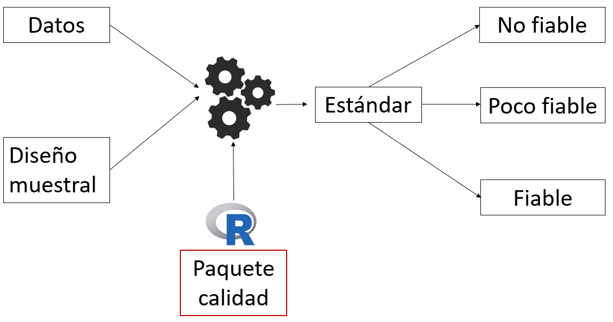
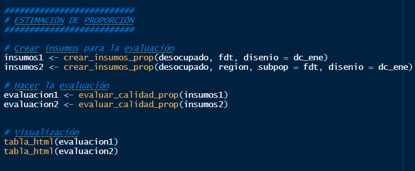
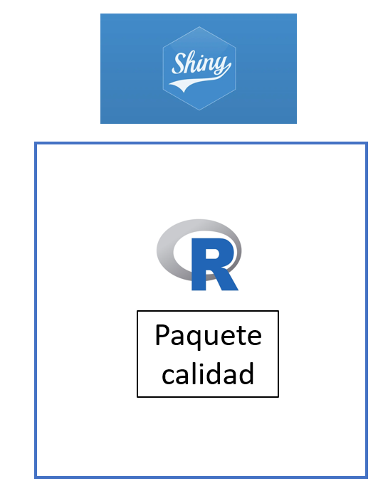
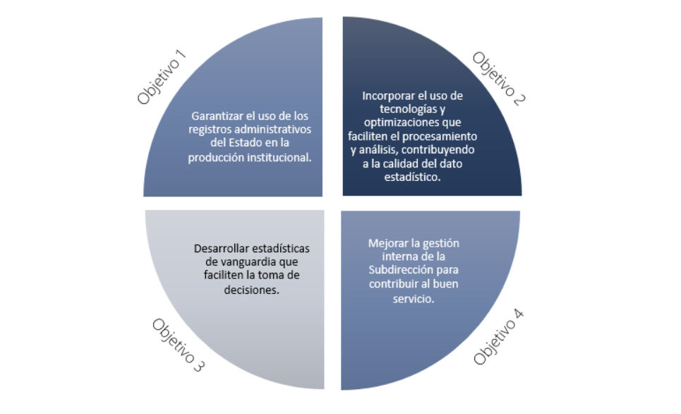
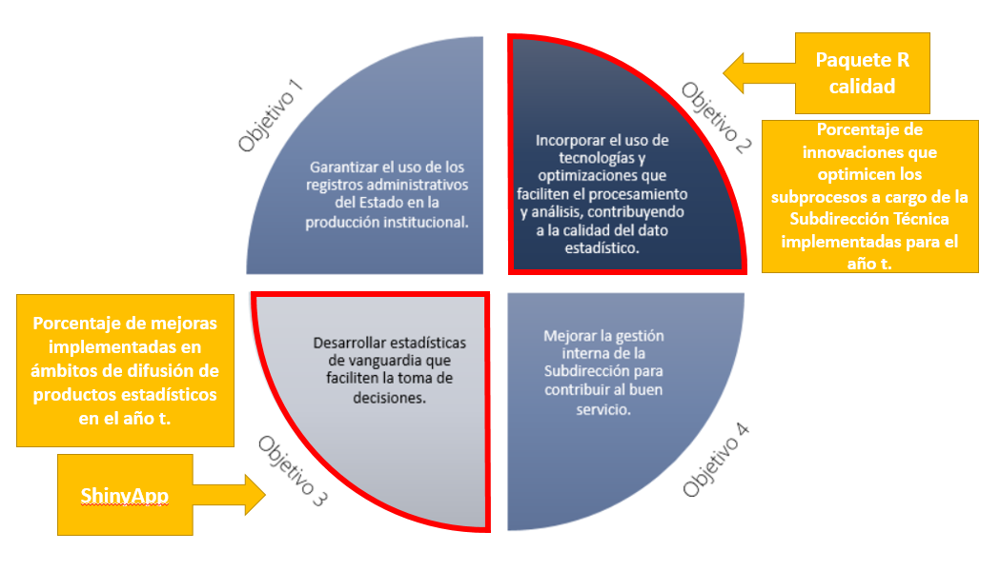

class: center, middle

.linea-superior[]
.linea-inferior[]


## Aplicación shiny para la evaluación de calidad de estimaciones

## Proyecto Estratégico de Servicios Compartidos

### Febrero 2021


```{r setup, include=FALSE}
options(htmltools.dir.version = FALSE)
knitr::opts_chunk$set(message = FALSE, warning = FALSE) 
```

```{r xaringan-themer, include=FALSE, warning=FALSE}
library(xaringanthemer)
#style_duo_accent(
 # primary_color = "#1381B0",
  #secondary_color = "#FF961C",
  #inverse_header_color = "#FFFFFF"
#)
```


---
background-image: url("imagenes/fondo2.PNG")
background-size: contain;
background-position: 100% 0%

# Paquete R Calidad de estimaciones


<br>

.center[


]


---
background-image: url("imagenes/fondo2.PNG")
background-size: contain;
background-position: 100% 0%

# Uso del paquete calidad

El paquete pone a disposición funciones que aplican el estándar de calidad de manera sencilla.

.center[


]

.center[.medium-par[👀 Esto se presentó en Comité Directivo del 17 de diciembre del 2020]]

---

background-image: url("imagenes/fondo2.PNG")
background-size: contain;
background-position: 100% 0%

#  Uso del paquete calidad

El paquete de calidad arroja *Outputs* como este.

```{r, echo=FALSE, message=FALSE, fig.align='center'}
library(calidad)
library(tidyverse)
ene <- ene %>%
  mutate(ocupado = if_else(cae_especifico >= 1 & cae_especifico <= 7, 1, 0),
         fdt = if_else(cae_especifico >= 1 & cae_especifico <=9, 1, 0 ),
         desocupado = if_else(cae_especifico >= 8 & cae_especifico <= 9, 1, 0))

options(survey.lonely.psu = "certainty")
dc_ene <- survey::svydesign(ids = ~conglomerado, strata = ~estrato_unico, data = ene, weights = ~fact_cal)

insumos <- crear_insumos_tot(desocupado, region, subpop = fdt,  disenio = dc_ene)
evaluacion <- evaluar_calidad_tot(insumos, publicar = T)
tabla_html(evaluacion %>% select(-se, -eval_n) %>% slice(1:6))

```

---

background-image: url("imagenes/fondo2.PNG")
background-size: contain;
background-position: 100% 0%

# Barreras de entrada

--

- .medium-par[Tener `R` instalado en el computador]

--

- .medium-par[Conocimiento básico del lenguaje]

--

### ¿Nos gustaria que la .medium-par[.pur[mayor cantidad de personas]] posible usara el paquete calidad?

--

### ¿Nos gustaría .medium-par[.pur[acercar]] estas herramientas a las/os .medium-par[.pur[usuarias/os externas/os]]?

--

.center[


]

---

background-image: url("imagenes/fondo2.PNG")
background-size: contain;
background-position: 100% 0%

# Paquete calidad y shiny


`Shiny` es un paquete de `R` que permite generar aplicaciones de manera sencilla.


.center[


]

--

.medium-par[Podemos implementar el .pur[paquete de calidad] dentro de .pur[shiny].]


---
background-image: url("imagenes/fondo2.PNG")
background-size: contain;
background-position: 100% 0%


class: center, middle

.big-par[
¡Veamos la aplicación! ️
]

.big-par[🖥️🖱️]

---

background-image: url("imagenes/fondo2.PNG")
background-size: contain;
background-position: 100% 0%

# Aplicaciones Shiny

<br/>
<br/>

--

- .medium-par[[ONE Scotland](https://scotland.shinyapps.io/sg-scottish-household-survey/)]

--

- .medium-par[[ONE Nueva Zelanda - Ingresos y gastos](https://statisticsnz.shinyapps.io/livingcostsexplorer/)]

--

- .medium-par[[Scottish Energy Statistics Hub - gob](https://scotland.shinyapps.io/sg-scottish-household-survey/)]

--

- .medium-par[[Graficador - Centro de estudios públicos](https://www.cepchile.cl/cep/site/edic/base/port/graficador.html)]

--

<br/>

.center[.medium-par[El uso de herramientas .pur[*open source*] acercan a las .pur[instituciones] con las .pur[comunidades] de usuarias/os]]

---

background-image: url("imagenes/fondo2.PNG")
background-size: contain;
background-position: 100% 0%

# Compromisos institucionales

.center[

]

---

background-image: url("imagenes/fondo2.PNG")
background-size: contain;
background-position: 100% 0%

# Compromisos institucionales

.center[

]

---

background-image: url("imagenes/fondo2.PNG")
background-size: contain;
background-position: 100% 0%

# Próximos pasos

### Paquete calidad

--

- SDT revisó el paquete calidad y **no se encontraron diferencias en las estimaciones**.

--

- Incorporar comentarios de SDT y de SdDMM - DMIE.

--

- Evaluar incorporación de precisión para la mediana (sugerencia de SdDMM - DMIE).

--

- Coordinar trabajo conjunto con SdDMM - DMIE.    

--

- Traducir documentación a inglés (requisito para entrar a **CRAN**).

--

### Shinyapp

--

- Optimizar las funcionalidades actuales 

--

- Evaluar incorporación de nuevas funcionalidades.

--

- Coordinación con SDTI, para asegurar la calidad de la aplicación.

---

class: center, middle

.linea-superior[]
.linea-inferior[]


## Aplicación shiny para la evaluación de calidad de estimaciones

## Proyecto Estratégico de Servicios Compartidos

### Febrero 2021


